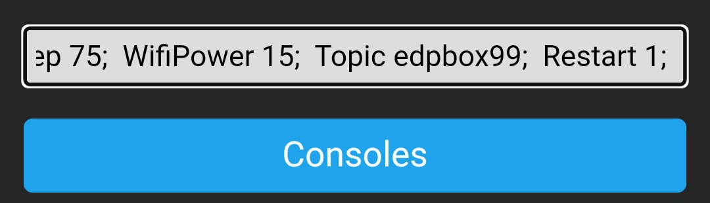
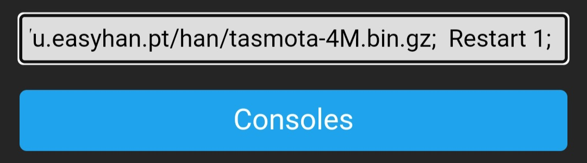
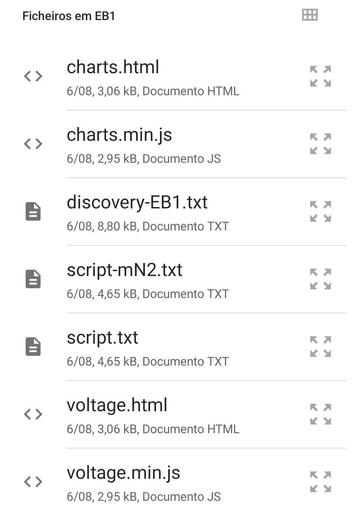
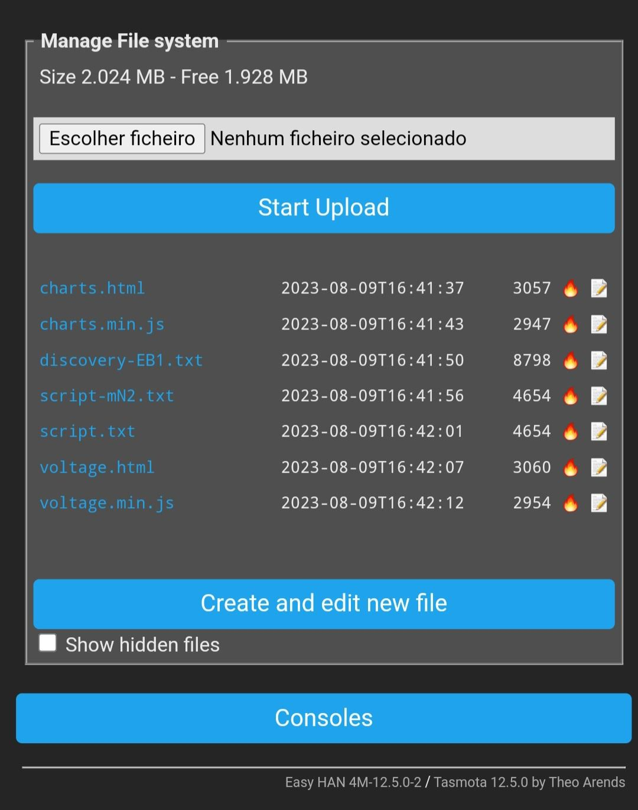
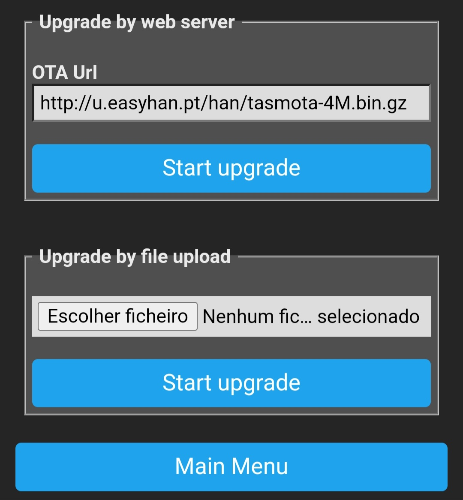

# Easy HAN ® V2

Tasmota > Consoles > Console

1.



(linha única)

```js
Backlog0 
TimeZone 99; 
TimeDST 0,0,3,1,1,60; 
TimeSTD 0,0,10,1,2,0; 
MqttUser none; 
MqttPassword none; 
MqttClient Easy_HAN_%06X; 
WebLog 2;
SerialLog 0;
Sleep 75; 
WifiPower 15;
Topic edpbox99; 
Restart 1; 
```

2. 



(linha única)

```js
Backlog0 
Hostname Easy-HAN-EB99; 
Template {"NAME":"easyhan.pt","GPIO":[1,1,1,1,1,1,1,1,1,1,1,1,1,1],"FLAG":0,"BASE":18}; 
Module 0; 
WifiConfig 2; 
OtaUrl http://u.easyhan.pt/v2/tasmota-4M.bin.gz; 
Restart 1; 
``` 

3. Upload files

Monofásico:


http://u.easyhan.pt/v2/setup-v2/EB1/

Trifásico:


http://u.easyhan.pt/v2/setup-v2/EB3/

Zip com tudo:


https://u.easyhan.pt/v2/setup-v2/HAN-V2.zip





4. OTA Upgrade

```http://u.easyhan.pt/v2/tasmota-4M.bin.gz```



...

5. Enable Script

```js
Backlog Script 1; SaveData 9; Restart 1;
```

<hr>

---

https://easyhan.pt/?v2

Easy HAN ® V2

