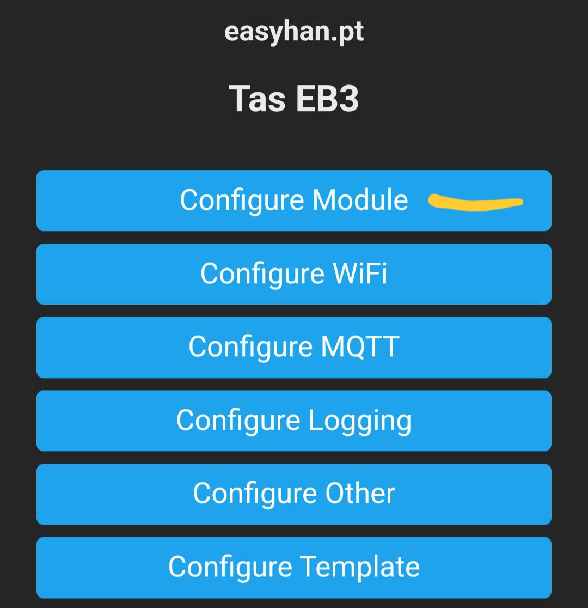
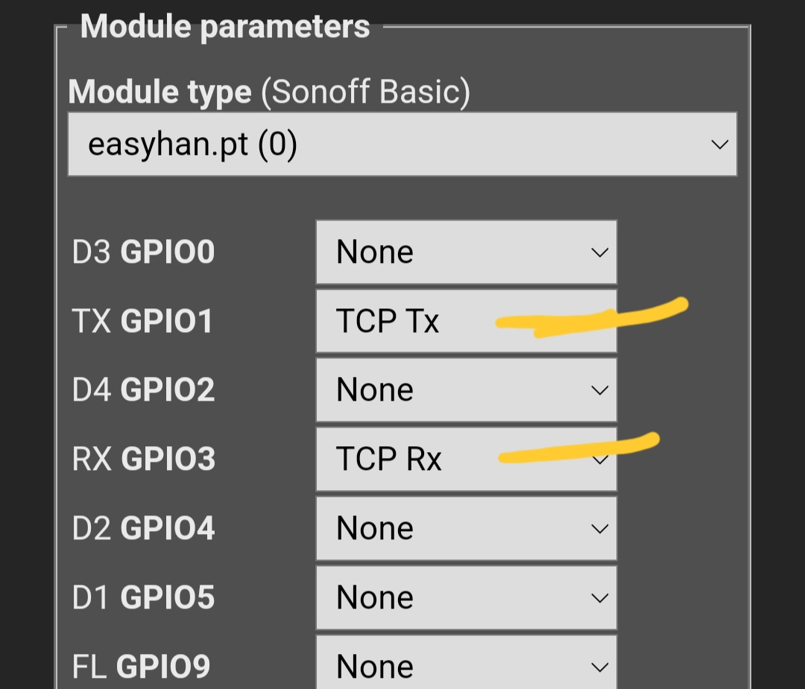

V2: firmware *-tcp

https://u.easyhan.pt/v2/

V1: default

RTU over TCP:

https://github.com/nikito7/easyhan/blob/dev/bridge/Bridge-RTUoverTCP.js

Modbus TCP:

https://github.com/nikito7/easyhan/blob/dev/bridge/Bridge-ModbusTCP.js
