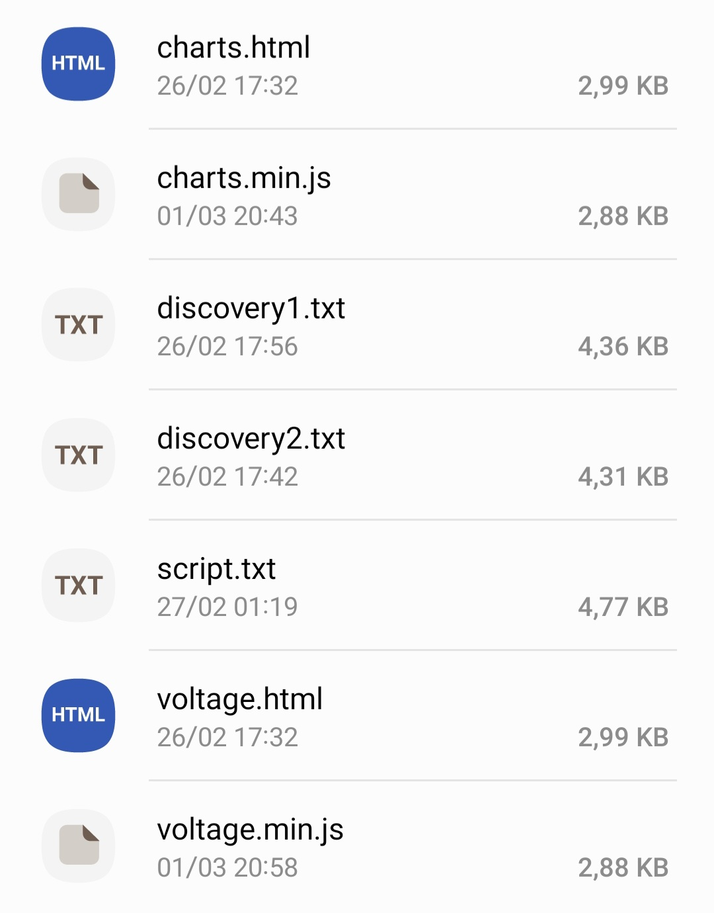

Tasmota > Consoles > Console

1.

```js
Backlog 
TimeZone 99; 
TimeDST 0,0,3,1,1,60; 
TimeSTD 0,0,10,1,2,0; 
MqttUser none; 
MqttPassword none; 
MqttClient Easy_HAN_%06X; 
WebLog 4; 
SerialLog 0; 
Topic edpbox99; 
Restart 1; 
```

2.

```js
Backlog 
SSID2 edpbox2-dev; 
Password2 edpbox123; 
Hostname Easy-HAN-EBx; 
SetOption65 1; 
Template {"NAME":"easyhan.pt","GPIO":[1,1,1,1,1,1,1,1,1,1,1,1,1,1],"FLAG":0,"BASE":18}; 
Module 0; 
WifiConfig 2; 
OtaUrl http://u.easyhan.pt/han/tasmota-4M.bin.gz; 
Restart 1; 
``` 

---

3. Upload files



4. OTA Upgrade

...

5. Enable Script

...

6. Restart

...
