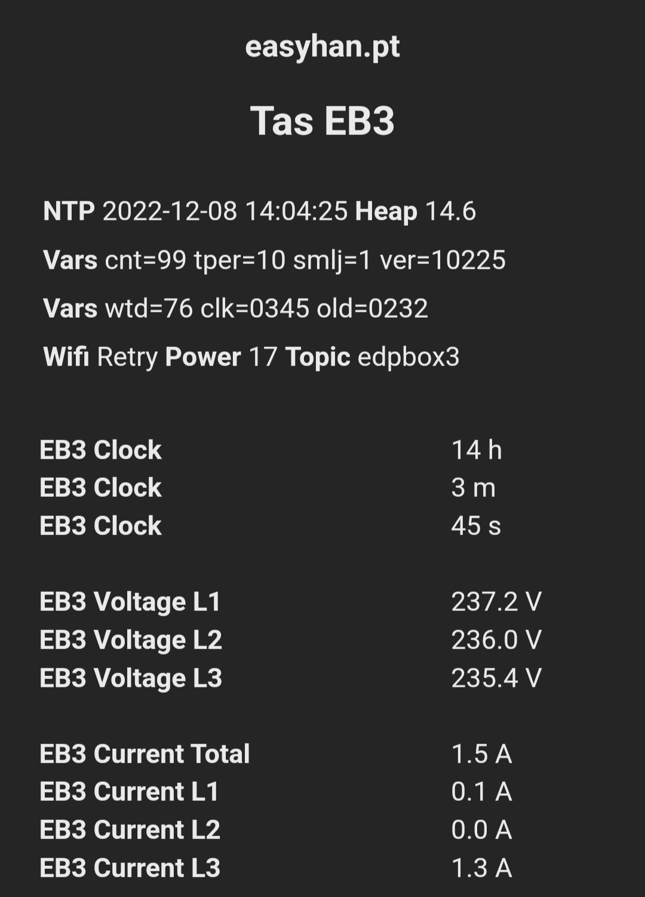
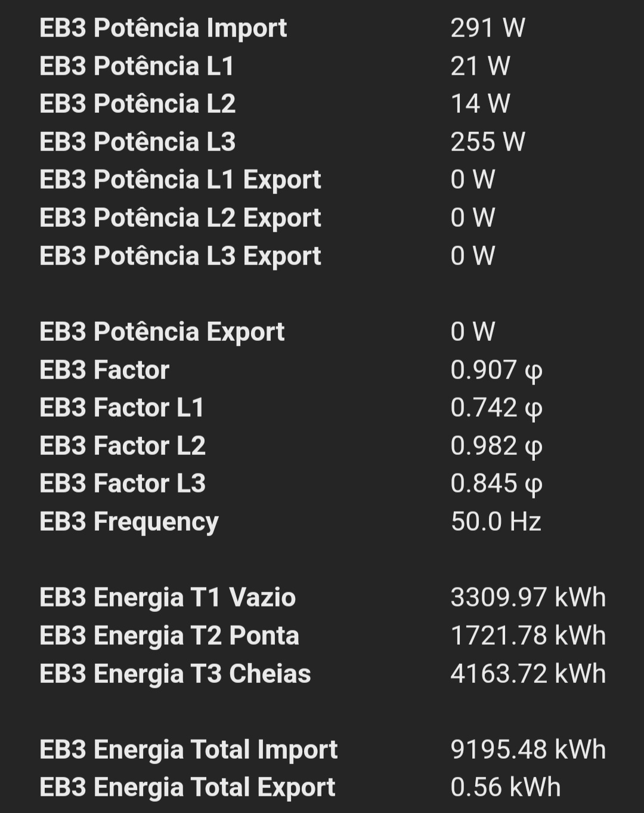
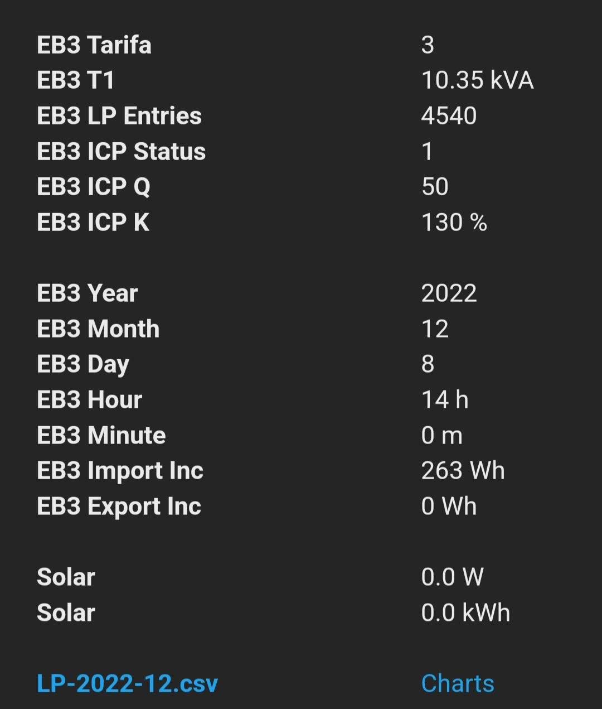
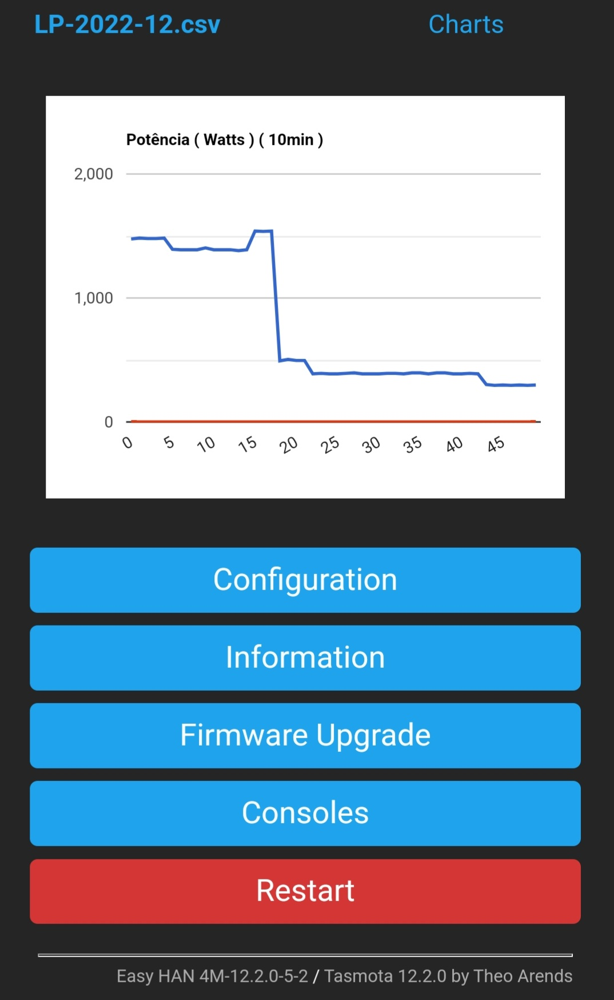
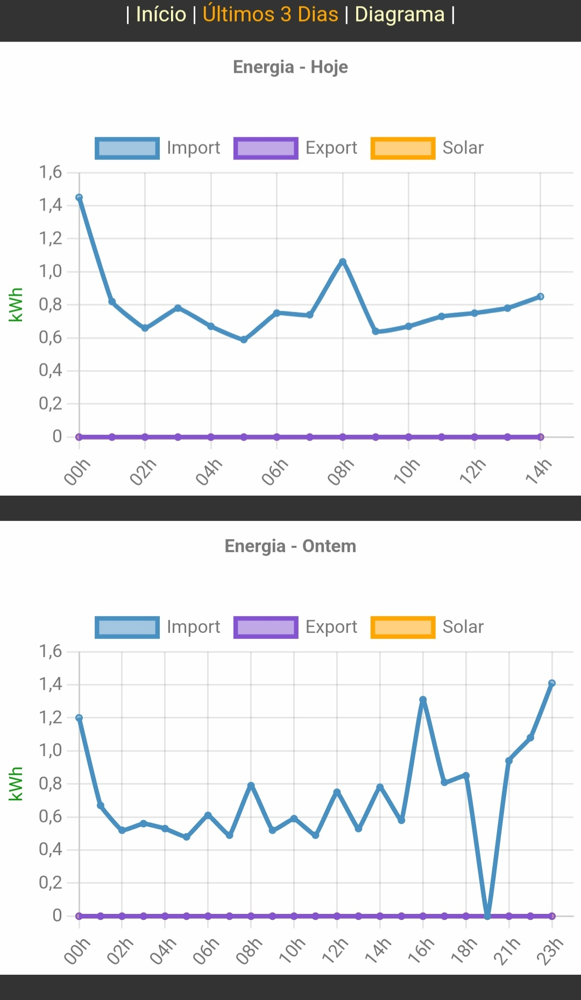
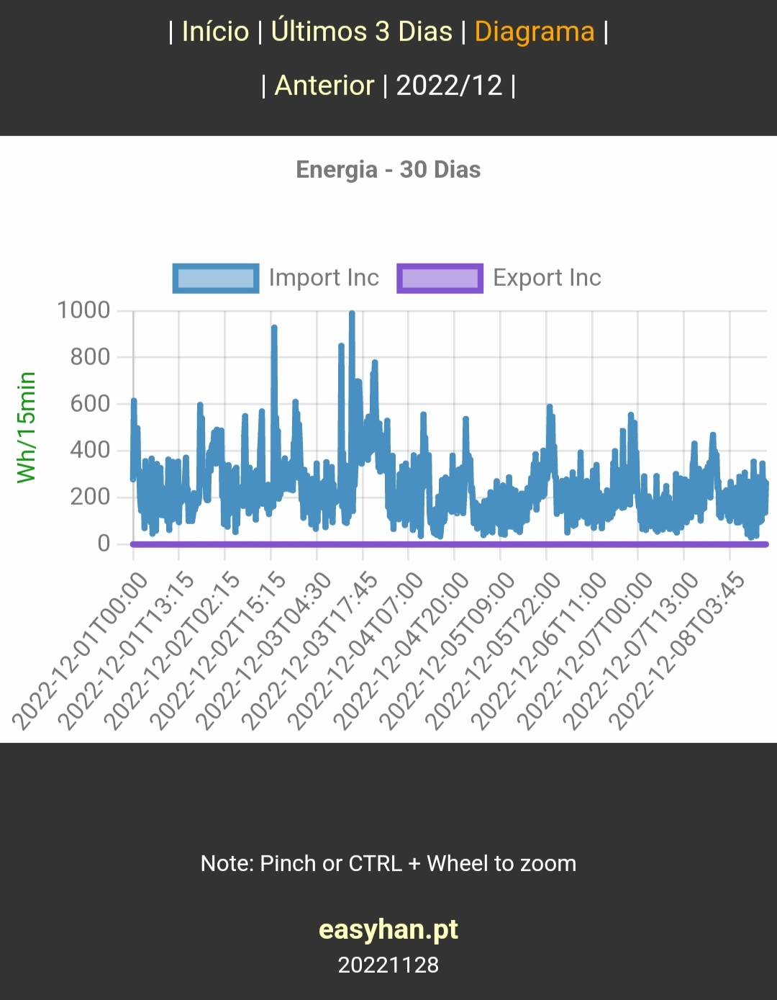
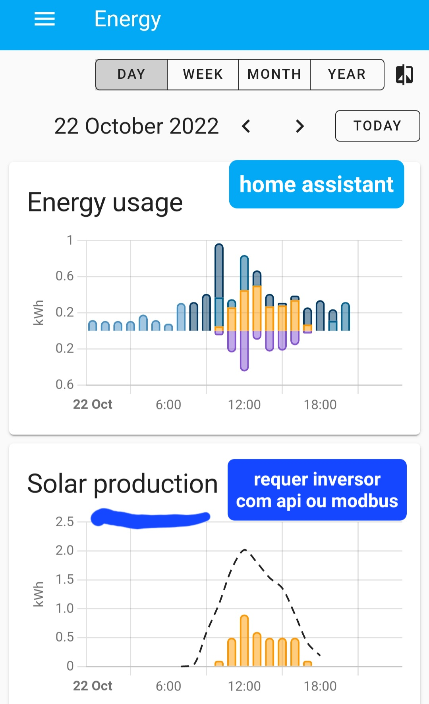

# Easy HAN RS485 ®

Leitor da porta HAN.

Medidor de consumo via porta HAN. 

Acesso aos dados do contador.

Acesso ao Diagrama de Carga (netmetering)

Adaptador Modbus para WiFi.


<i>Imagem demonstrativa</i>

[](https://discord.gg/Mh9mTEA) 

Mais info no forum:

https://forum.cpha.pt/t/easy-han-rs485-edpbox-modbus/9977

# Contadores
> Testados com alimentação directa na HAN.
> Sem modem gprs externo.

Monofásicos:

- ```Kaifa MA109P```

- ```Landis+Gyr```

- ```Sagemcom CX1000-6```

- ```Sagemcom S212```

Trifásicos:

- ```Janz B2801 GPRS```

- ```Landis+Gyr```

- ```Sagemcom CX2000-9```

Notas:

Landis+Gyr: Serial mN1/mN2.

# Tasmota













# Home Assistant



---

[](https://discord.gg/Mh9mTEA) 
