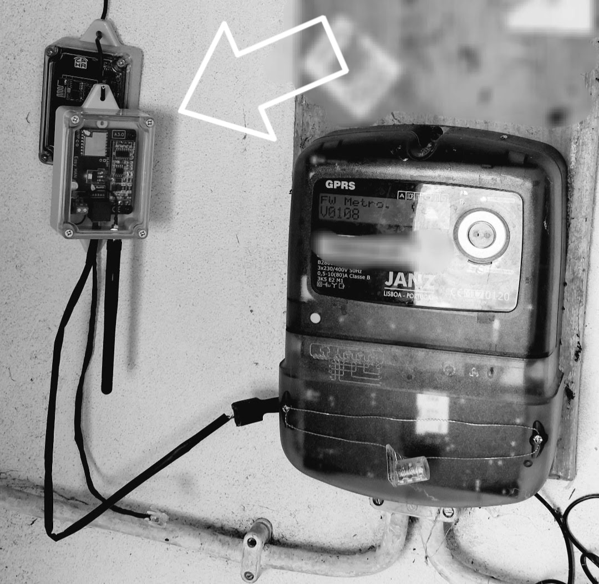
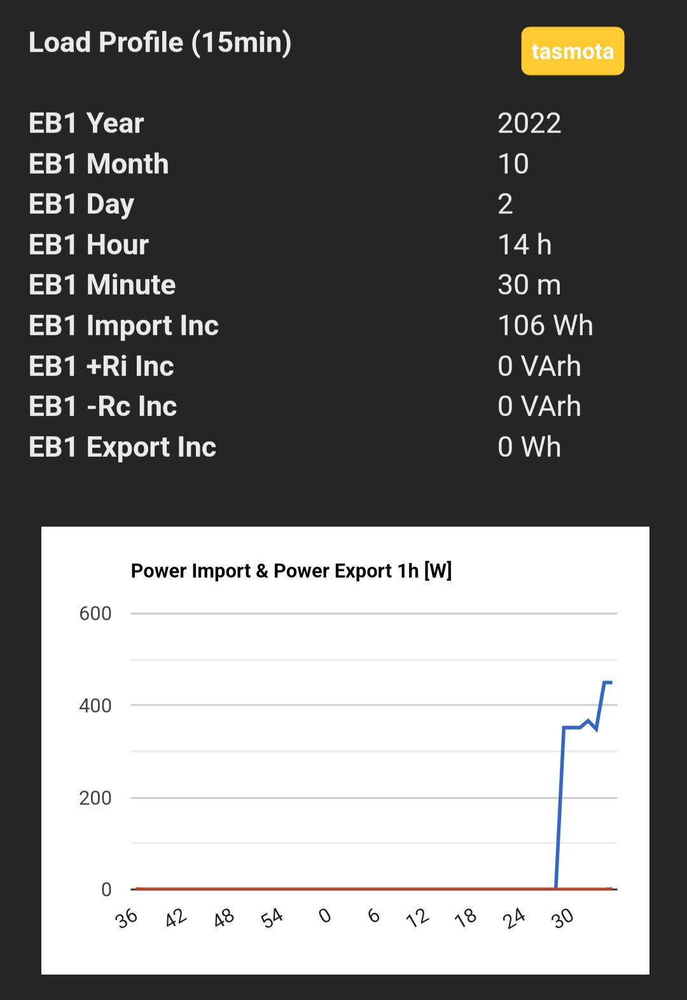

# Easy HAN RS485

Leitor e medidor da porta HAN.

Acesso aos dados do contador.

Adaptador Modbus para WiFi.



<i>Imagem demonstrativa</i>

[](https://discord.gg/Mh9mTEA) 

Mais info no forum:

https://forum.cpha.pt/t/easy-han-rs485-edpbox-modbus/9977

Tutorial WiFi e MQTT:

https://forum.cpha.pt/t/easy-han-tasmota-configuracao-wifi-mqtt/10486

OLX:

https://m.olx.pt/d/anuncio/leitor-da-porta-han-modbus-rs485-easyhan-pt-IDHnjLr.html

# Contadores
> Testados com alimentação directa na HAN.
> Sem modem gprs externo.

Monofásicos:

- ```Kaifa MA109P```

- ```Landis+Gyr```

- ```Sagemcom CX1000```

- ```Sagemcom S212```

Trifásicos:

- ```Janz B2801 GPRS```

- ```Landis+Gyr```

- ```Sagemcom CX2000```

Notas:

Landis+Gyr: Serial mN1/mN2.

# Pedido da HAN

https://www.e-redes.pt/pt-pt/transicao-energetica/redes-do-futuro/acesso-porta-serie-de-comunicacao

https://forum.cpha.pt/t/pedido-da-porta-han-e-redes-pt-2022/10869

# Imagens




# Home Assistant


---

[](https://discord.gg/Mh9mTEA) 
